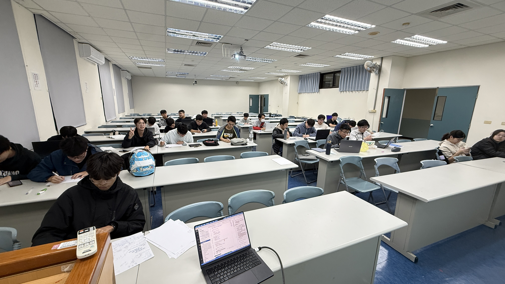

今天資安戰隊及 NPU-EGO 會前會，預計要討論以下議題：

<!-- truncate -->

## 會議議程

### 1. PicoCTF 3 題
討論 PicoCTF 競賽平台的題目。

- [file-run1](https://play.picoctf.org/practice/challenge/266?category=3&difficulty=2&originalEvent=70&page=1&search=)
- [file-run2](https://play.picoctf.org/practice/challenge/267?category=3&difficulty=2&originalEvent=70&page=1&search=)
- [bloat.py](https://play.picoctf.org/practice/challenge/256?category=3&difficulty=2&originalEvent=70&page=1&search=)

### 2. NPU-EGO 社團會前會
- **社團章程**：審閱與確認社團組織章程
- **社團成立大會**：籌備成立大會相關事宜
- **其它討論**：其他社團運作相關議題

### 3. 資安議題
討論近期資安相關議題與訓練方向。

---

## 會議資訊

- **時間**：今天 17:30
- **地點**：多功能教室

請各位準時出席，謝謝！

